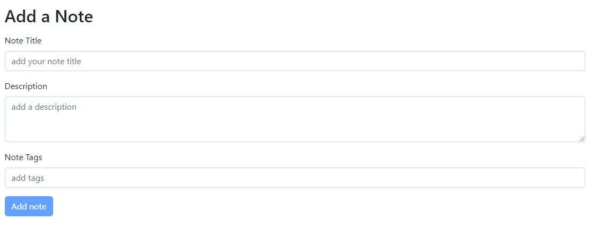
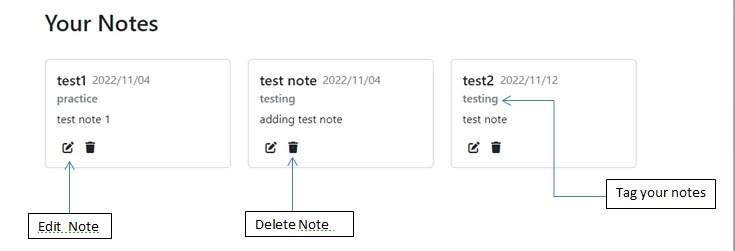

# DigiNotebook
<strong>Note down all your ideas,thoughts,plans in one secure place.</strong>

Just SignUp and get started :)

<strong>A web application built on MERN stack</strong> 

## :round_pushpin:Functions
1) Provides secure authentication by encrypting passwords and storing their hash in database. Json Web Tokens are used for safe information transfer.

2) Performs all CRUD operations

<h2>Instructions</h2>

Frontend running on [http://localhost:3000](http://localhost:5000)

Backend running on [http://localhost:5000](http://localhost:5000)

### `npm run both`

Runs frontend and backend concurrently. 

